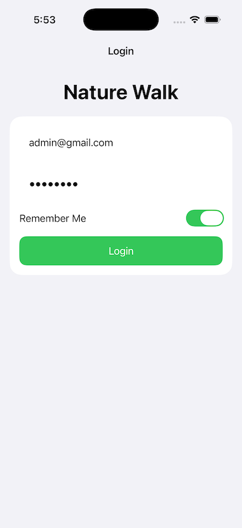
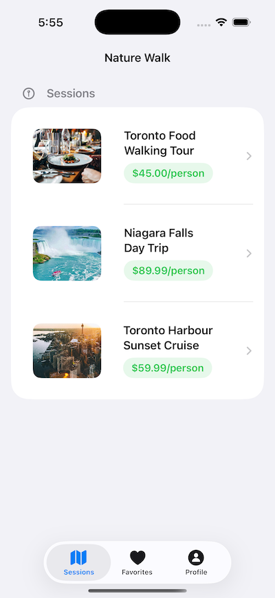
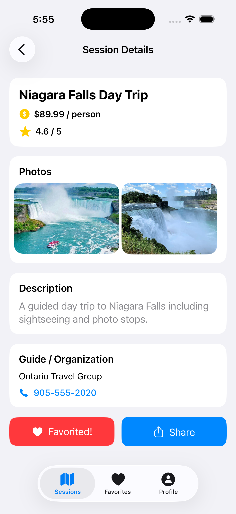
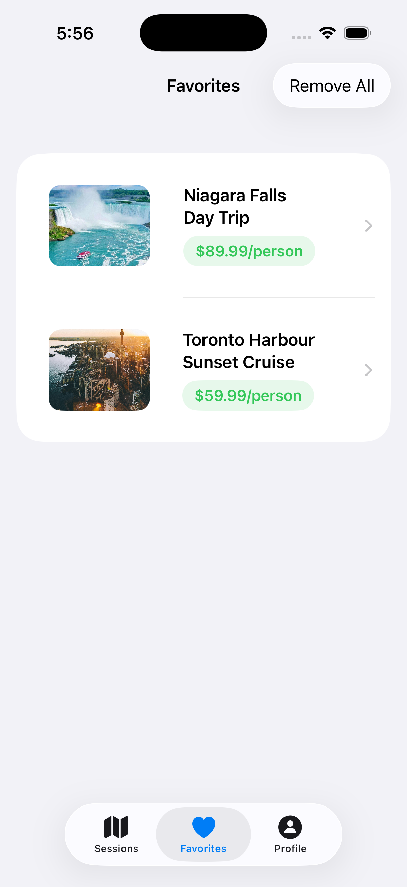

# Nature Walk

An iOS course project for discovering group outings, reviewing session details, contacting hosts, sharing activities, and maintaining user-specific favorites.

## Demo

| Sign in | Browse sessions |
| --- | --- |
|  |  |
| Restore remembered credentials and authenticate with a sample account. | Compare available outings and open a session for more information. |

| Review session details | Manage favorites |
| --- | --- |
|  |  |
| Review pricing, ratings, photos, host details, and native contact and sharing actions. | Revisit saved outings or remove individual and all user-specific favorites. |

## Project Context and Scope

Nature Walk was designed and implemented by Chuhan Shang. Chuhan built the SwiftUI interface, authentication flow, session browsing experience, user-specific favorites persistence, and native sharing and calling integrations.

The app is a local prototype: authentication and session records use bundled sample data rather than a backend service. Remote images require an internet connection.

## Key Workflows

- Sign in with a sample account, with validation for missing or incorrect credentials.
- Optionally restore remembered credentials on the next launch without automatically signing in.
- Browse three sample outings and open a detail screen with pricing, rating, photos, description, and host information.
- Call a host through the iOS dialer or share a formatted session summary with the system share sheet.
- Add or remove sessions from a favorites list scoped to the active user.
- Remove one favorite with a confirmation prompt or clear the entire list.
- Review the active user's profile and return to the login screen through a confirmed logout flow.

## Technical Highlights

- **Shared observable state:** `SessionViewModel` and `UserViewModel` use the Observation framework and are injected through SwiftUI's environment, keeping authentication and favorites consistent across tabs without global singletons.
- **User-specific persistence:** Codable user records and favorite session IDs are stored in `UserDefaults`. Stable UUIDs for bundled sessions preserve favorite mappings across launches.
- **Native platform integrations:** `AsyncImage` loads remote session media, `ShareLink` presents the system share sheet, and `openURL` creates sanitized `tel://` links for host calls.
- **Explicit session behavior:** Remember Me restores form values, while the authenticated session remains in memory and logout returns the app to its login root.

> **Prototype security note:** The sample passwords and remembered credentials are stored locally in plain form for coursework demonstration. A real application should use server-side authentication and Keychain-backed credential storage.

## Architecture

The app entry point owns both observable view models and switches between the login flow and the authenticated tab interface. Views read shared state from the SwiftUI environment and send user actions back to the relevant view model.

```text
Group_Nature_Walk_ProjectApp
├── LoginView ─────────────── UserViewModel ── UserDefaults
└── ContentView (TabView)
    ├── SessionView ───────── SessionViewModel ── bundled sample sessions
    │   └── DetailSessionView
    ├── FavoritesView ─────── UserViewModel + SessionViewModel
    └── ProfileView ───────── UserViewModel
```

The source is organized by responsibility:

```text
Group_Nature_Walk_Project/
├── Model/       # Codable Session and User value types
├── View/        # Login, tab, list, detail, favorites, and profile UI
├── ViewModel/   # Session data, authentication, and persistence logic
└── Group_Nature_Walk_ProjectApp.swift
```

## Tech Stack

| Area | Technology |
| --- | --- |
| Language | Swift 5 |
| UI | SwiftUI |
| State management | Observation (`@Observable`) and SwiftUI environment injection |
| Persistence | `UserDefaults`, `Codable`, and `JSONEncoder` / `JSONDecoder` |
| Platform APIs | `AsyncImage`, `ShareLink`, and `openURL` |
| Development | Xcode project targeting iPhone and iPad |

## Running the Project

### Prerequisites

- macOS with Xcode 26.5 or a compatible newer version
- An iOS 26.5 simulator or device, matching the configured deployment target
- Internet access to load the remote sample images

### Run

1. Clone the repository.
2. Open `Group_Nature_Walk_Project.xcodeproj` in Xcode.
3. Select the `Group_Nature_Walk_Project` scheme and an iOS simulator or connected device.
4. Build and run with **Product > Run** (`⌘R`).

Use either bundled sample account:

| Email | Password |
| --- | --- |
| `test@gmail.com` | `test123` |
| `admin@gmail.com` | `admin123` |

No API keys or additional configuration files are required.

## Author

**Chuhan Shang**

[GitHub](https://github.com/shangc97)
